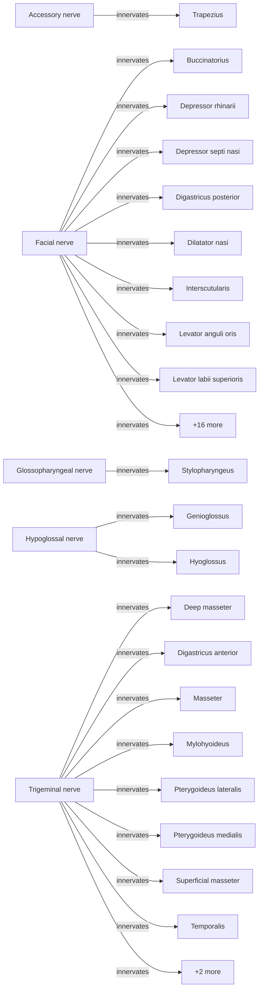
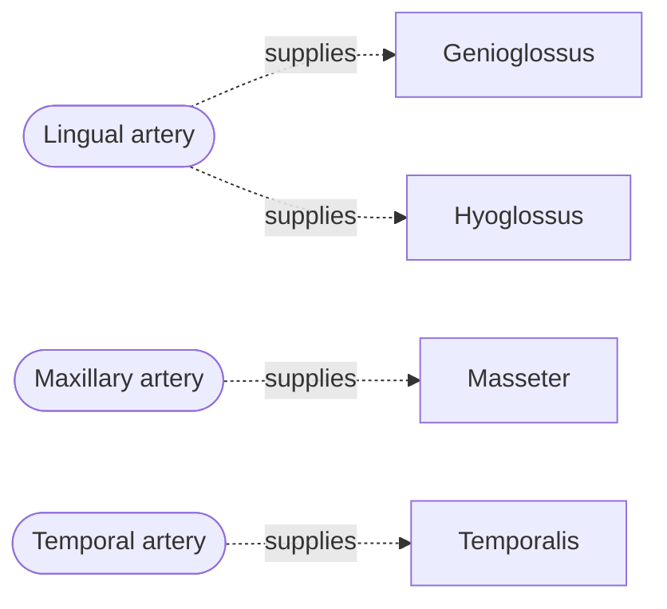

# BAP Mouse Head Ontology

A collaborative repository for managing the Brain Architecture Project (BAP) mouse head anatomical ontology.

## 📚 [**View the Auto-Generated Wiki →**](https://mitralab-organization.github.io/bap-ontology-editor/)

Complete documentation with detailed reports, statistics, and visualizations - **automatically updated on every push!**

## Overview

This repository provides a human-readable way to manage:
- **Anatomical structures** (muscles, nerves, blood vessels)
- **Hierarchies** (parent-child relationships)
- **Biological relationships** (innervation, blood supply, developmental origins)

Changes are validated automatically via GitHub Actions and generate OWL files for use in WebProtégé and other tools.

<!-- STATS_START -->
📊 **Ontology Statistics**
```
├── Structures: 211
├── Hierarchy depth: 7 levels
└── Relationships: 45
    ├── Innervated By: 38
    ├── Part Of: 3
    └── Supplied By: 4
```
<!-- STATS_END -->

## Current Hierarchy

<!-- HIERARCHY_START -->
```
Body
├── Appendages
│   ├── Forelimb
│   │   ├── clavicle
│   │   └── scapula
│   ├── Hindlimb
│   └── Tail
├── Head
│   ├── Cavities and passages
│   │   ├── Ear Cavities
│   │   │   ├── external acoustic meatus
│   │   │   └── internal acoustic meatus
│   │   ├── Nasal cavity
│   │   ├── Nasal sinuses
│   │   └── Oral cavity
│   ├── Endocrine and exocrine system
│   │   ├── Palatal submucosa
│   │   └── Parotid glands
│   ├── Integumentary system
│   │   ├── External ear
│   │   │   └── Pinna
│   │   ├── Skin
│   │   └── Whiskers
│   ├── Musculoskeletal system
│   │   ├── Cranial muscles
│   │   │   ├── Buccinatorius
│   │   │   ├── Ceratohyoideus
│   │   │   ├── Depressor rhinarii
│   │   │   ├── Depressor septi nasi
│   │   │   ├── Digastricus anterior
│   │   │   ├── Digastricus posterior
│   │   │   ├── Dilatator nasi
│   │   │   ├── External Ear Muscles
│   │   │   │   ├── Auricularis anterior
│   │   │   │   ├── Auricularis posterior
│   │   │   │   └── Auricularis superior
│   │   │   ├── Eye Muscles
│   │   │   │   ├── inferior oblique
│   │   │   │   ├── lateral rectus
│   │   │   │   ├── levator palpebrae superioris
│   │   │   │   ├── medial rectus
│   │   │   │   ├── retractor bulbi
│   │   │   │   ├── superior oblique muscle
│   │   │   │   │   └── superior oblique tendon
│   │   │   │   │       └── trochlea
│   │   │   │   └── superior rectus
│   │   │   ├── Frontalis
│   │   │   ├── Geniohyoideus
│   │   │   ├── Inner Ear Muscles
│   │   │   │   ├── Stapedius
│   │   │   │   └── Tensor tympani
│   │   │   ├── Interscutularis
│   │   │   ├── Levator anguli oris
│   │   │   ├── Levator labii superioris
│   │   │   ├── Levator labii superioris alaeque nasi
│   │   │   ├── Levator rhinarii
│   │   │   ├── Mandibuloauricularis
│   │   │   ├── Masseter
│   │   │   │   ├── Deep masseter
│   │   │   │   ├── Superficial masseter
│   │   │   │   └── Zygomaticomandibularis
│   │   │   ├── Mylohyoideus
│   │   │   ├── Nasalis
│   │   │   ├── Occipitalis
│   │   │   ├── Orbicularis oculi
│   │   │   ├── Orbicularis oris
│   │   │   ├── Orbito-temporo-auricularis
│   │   │   ├── Platysma cervicale
│   │   │   ├── Platysma myoides
│   │   │   ├── Pterygoideus lateralis
│   │   │   ├── Pterygoideus medialis
│   │   │   ├── Sphincter colli profundus
│   │   │   ├── Sphincter colli superficialis
│   │   │   ├── Sternohyoideus
│   │   │   ├── Stylohyoideus
│   │   │   ├── Stylopharyngeus
│   │   │   ├── Temporalis
│   │   │   │   ├── Temporalis lateralis
│   │   │   │   └── Temporalis medialis
│   │   │   ├── Tongue muscles
│   │   │   │   ├── Extrinsic tongue muscles
│   │   │   │   │   ├── Genioglossus
│   │   │   │   │   ├── Hyoglossus
│   │   │   │   │   ├── Palatoglossus
│   │   │   │   │   └── Styloglossus
│   │   │   │   └── Intrinsic tongue muscles
│   │   │   │       ├── Inferior longitudinal
│   │   │   │       ├── Superior longitudinal
│   │   │   │       ├── Transverse
│   │   │   │       └── Vertical
│   │   │   ├── Zygomaticus major
│   │   │   └── Zygomaticus minor
│   │   └── Cranium
│   │       ├── Inner ear
│   │       │   ├── incus
│   │       │   ├── malleus
│   │       │   └── stapes
│   │       ├── Neurocranium
│   │       │   ├── basisphenoid
│   │       │   ├── ethmoid
│   │       │   ├── frontal
│   │       │   ├── interparietal
│   │       │   ├── occipital
│   │       │   ├── parietal
│   │       │   ├── presphenoid
│   │       │   └── tympanic membrane
│   │       └── Viscerocranium
│   │           ├── Jaw apparatus
│   │           │   ├── mandible
│   │           │   └── maxilla
│   │           ├── lacrimal
│   │           ├── nasal
│   │           ├── palatine
│   │           ├── premaxilla
│   │           ├── sphenoid
│   │           ├── squamosal
│   │           ├── vomer
│   │           └── zygomatic
│   ├── Nervous system
│   │   ├── Central nervous system
│   │   │   └── Brain
│   │   └── Peripheral nervous system
│   │       └── Cranial Nerves
│   │           ├── Abducens nerve
│   │           ├── Accessory nerve
│   │           ├── Facial nerve
│   │           ├── Glossopharyngeal nerve
│   │           ├── Hypoglossal nerve
│   │           ├── Oculomotor nerve
│   │           ├── Olfactory nerve
│   │           ├── Optic nerve
│   │           ├── Terminal nerve
│   │           ├── Trigeminal nerve
│   │           ├── Trochlear nerve
│   │           ├── Vagus nerve
│   │           └── Vestibulocochlear nerve
│   ├── Sense organs
│   │   ├── Eye
│   │   ├── Gustatory epithelium
│   │   ├── Inner ear
│   │   ├── Olfactory epithelium
│   │   └── Whisker barrels
│   └── Vascular system
│       ├── Arteries
│       │   ├── Lingual artery
│       │   ├── Maxillary artery
│       │   └── Temporal artery
│       ├── Lymphatics
│       └── Veins
├── Neck
│   ├── Cavities and passages
│   │   ├── Larynx
│   │   └── Pharynx
│   │       ├── Esophagus
│   │       └── sternofacialis left
│   ├── Endocrine and exocrine system
│   │   └── Thyroid gland
│   ├── Integumentary system
│   │   └── Skin
│   ├── Musculoskeletal system
│   │   ├── Neck muscles
│   │   │   ├── Cleidomastoideus
│   │   │   ├── Cleidooccipitalis
│   │   │   ├── Cricothyroideus
│   │   │   ├── Jugulohyoideus
│   │   │   ├── Laryngeal muscles
│   │   │   │   ├── Arytenoideus
│   │   │   │   ├── Cricoarytenoideus alaris
│   │   │   │   ├── Cricoarytenoideus lateralis
│   │   │   │   ├── Cricoarytenoideus posterior
│   │   │   │   └── Thyroarytenoideus
│   │   │   ├── Omohyoideus
│   │   │   ├── Pharyngeal muscles
│   │   │   │   ├── Constrictor pharyngis inferior
│   │   │   │   ├── Constrictor pharyngis medius
│   │   │   │   ├── Constrictor pharyngis superior
│   │   │   │   ├── Levator veli palatini
│   │   │   │   ├── Palatopharyngeus
│   │   │   │   ├── Pterygopharyngeus
│   │   │   │   ├── Salpingopharyngeus
│   │   │   │   └── Tensor veli palatini
│   │   │   ├── Sternomastoideus
│   │   │   ├── Sternothyroideus
│   │   │   ├── Thyrohyoideus
│   │   │   └── Trapezius
│   │   │       ├── Acromiotrapezius
│   │   │       └── Spinotrapezius
│   │   └── Neck skeletal system
│   │       ├── Laryngeal skeletal system
│   │       │   ├── arytenoid cartilage
│   │       │   ├── cricoid cartilage
│   │       │   ├── epiglottis
│   │       │   ├── laryngeal alar cartilage
│   │       │   └── thyroid cartilage
│   │       ├── Pharyngeal skeleton
│   │       │   └── hyoid bone
│   │       └── cervical vertebra
│   ├── Nervous system
│   │   ├── Central nervous system
│   │   │   └── Spinal Cord
│   │   └── Peripheral nervous system
│   │       └── Cervical nerves
│   └── Vascular system
│       ├── Arteries
│       ├── Lymphatics
│       └── Veins
└── Trunk
    ├── Abdomen
    ├── Pelvis
    └── Thorax
        └── sternum
```
<!-- HIERARCHY_END -->

## Relationships

<!-- MERMAID_START -->
#### Innervation Map


#### Blood Supply Map

<!-- MERMAID_END -->

<!-- TABLES_START -->
### Innervation

| Nerve | Innervates |
|-------|------------|
| Accessory nerve | Trapezius |
| Facial nerve | Buccinatorius, Depressor rhinarii, Depressor septi nasi, Digastricus posterior, Dilatator nasi, Interscutularis, Levator anguli oris, Levator labii superioris, Levator labii superioris alaeque nasi, Levator rhinarii, Mandibuloauricularis, Nasalis, Occipitalis, Orbicularis oculi, Orbicularis oris, Orbito-temporo-auricularis, Platysma cervicale, Platysma myoides, Sphincter colli profundus, Sphincter colli superficialis, Stapedius, Stylohyoideus, Zygomaticus major, Zygomaticus minor |
| Glossopharyngeal nerve | Stylopharyngeus |
| Hypoglossal nerve | Genioglossus, Hyoglossus |
| Trigeminal nerve | Deep masseter, Digastricus anterior, Masseter, Mylohyoideus, Pterygoideus lateralis, Pterygoideus medialis, Superficial masseter, Temporalis, Tensor veli palatini, Zygomaticomandibularis |

### Blood Supply

| Artery | Supplies |
|--------|----------|
| Lingual artery | Genioglossus, Hyoglossus |
| Maxillary artery | Masseter |
| Temporal artery | Temporalis |
<!-- TABLES_END -->

## Repository Structure

```
bap-ontology/
├── structures/           # Anatomical structure definitions
│   ├── muscles.yaml      # Muscle structures + hierarchies
│   ├── nerves.yaml       # Nerve structures
│   └── vessels.yaml      # Blood vessel structures
├── relationships/        # Cross-structure relationships
│   ├── innervation.yaml  # Nerve → muscle connections
│   ├── blood_supply.yaml # Vessel → structure connections
│   └── developmental.yaml# Developmental origins
├── schemas/              # JSON Schema for validation
│   └── structure.schema.json
├── scripts/              # Build and validation scripts
│   ├── validate.py       # Validate YAML files
│   ├── generate_owl.py   # Generate OWL from YAML
│   ├── generate_tree.py  # Generate hierarchy tree
│   └── process_*.py      # Issue processors
└── .github/workflows/    # CI/CD automation
    ├── validate.yml      # Validate on PR
    └── generate.yml      # Generate OWL on merge
```

## 🎯 Easy Way: Use Issue Templates (Recommended)

**No coding required!** Just fill out a form to propose changes:

### Add a New Structure

1. Go to [Issues → New Issue](../../issues/new/choose)
2. Select **"➕ Add New Structure"**
3. Fill out the form:
   - Structure name
   - Body region (Head, Neck, Trunk, Appendages)
   - Organ system
   - Parent structure
   - Definition
4. Submit the issue
5. A maintainer reviews and adds the `approved` label
6. 🤖 A PR is automatically created with the YAML changes!

### Add a New Relationship

1. Go to [Issues → New Issue](../../issues/new/choose)
2. Select **"🔗 Add New Relationship"**
3. Fill out the form:
   - Relationship type (innervation, blood supply, etc.)
   - Subject structure (e.g., the muscle)
   - Object structure (e.g., the nerve)
   - Confidence level
   - References
4. Submit and wait for approval

### Modify Hierarchy

Use the **"📁 Modify Hierarchy"** template to propose moving structures to different parents.

---

## 💻 Developer Way: Direct YAML Editing

For power users who prefer editing files directly:

### 1. Clone the repository

```bash
git clone https://github.com/MitraLab-Organization/bap-ontology-editor.git
cd bap-ontology-editor
```

### 2. Edit structures

Edit YAML files directly in `structures/` or `relationships/`:

```yaml
# structures/muscles.yaml
structures:
  - id: BAP_0001000
    name: Head muscle
    parent: null  # Root structure
    definition: Muscles of the head region

  - id: BAP_0001100
    name: Masseter
    parent: BAP_0001000
    definition: Primary muscle of mastication
    abbreviation: MAS
```

### 3. Create a Pull Request

1. Create a branch: `git checkout -b add-temporalis-muscle`
2. Make your changes
3. Push and open a PR
4. GitHub Actions validates your changes
5. Get review and merge

### 4. Generated OWL file

After merge, the `bap-mousehead.owl` file is automatically generated and available in the releases.

## YAML Format Reference

### Structure Definition

```yaml
structures:
  - id: BAP_0000001          # Required: Unique IRI identifier
    name: Structure Name      # Required: Human-readable name
    parent: BAP_0000000       # Optional: Parent structure ID (null for roots)
    definition: Description   # Optional: IAO definition text
    abbreviation: ABBR        # Optional: Short form
    external_id: UBERON_0001  # Optional: Cross-reference to external ontology
```

### Relationship Definition

```yaml
relationships:
  - subject: BAP_0001100      # Required: Source structure ID
    predicate: innervated_by  # Required: Relationship type
    object: BAP_0002001       # Required: Target structure ID
    reference: PMID:12345     # Optional: Citation
```

### Supported Relationship Types

| Predicate | OBO IRI | Description |
|-----------|---------|-------------|
| `part_of` | BFO_0000050 | Structure is part of another |
| `innervated_by` | RO_0002005 | Receives neural input from |
| `supplied_by` | RO_0002178 | Receives blood supply from |
| `develops_from` | RO_0002202 | Developmental origin |
| `adjacent_to` | RO_0002220 | Spatially contiguous |

## Local Development

### Prerequisites

- Python 3.9+
- PyYAML, jsonschema

### Setup

```bash
python -m venv venv
source venv/bin/activate
pip install -r requirements.txt
```

### Validate locally

```bash
python scripts/validate.py
```

### Generate OWL locally

```bash
python scripts/generate_owl.py --output bap-mousehead.owl
```

## Access Control

This repository uses GitHub's built-in access controls:

- **Collaborators**: Can push branches and create PRs
- **Branch protection**: Main branch requires PR reviews
- **CODEOWNERS**: Specific reviewers for critical files

To request access, contact the repository administrators.

## Contributing

1. Create a feature branch from `main`
2. Make your changes to YAML files
3. Run `python scripts/validate.py` locally
4. Open a Pull Request
5. Address review feedback
6. Merge after approval

## License

[CC BY 4.0](https://creativecommons.org/licenses/by/4.0/) - Brain Architecture Project
