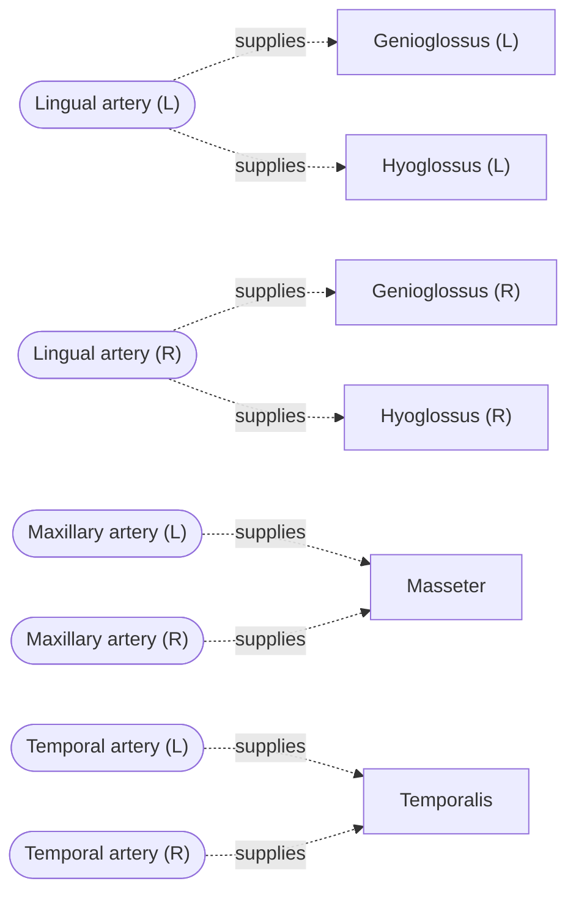

# BAP Mouse Head Ontology

A collaborative repository for managing the Brain Architecture Project (BAP) mouse head anatomical ontology.

## 📚 [**View the Auto-Generated Wiki →**](https://mitralab-organization.github.io/bap-ontology-editor/)

Complete documentation with detailed reports, statistics, and visualizations - **automatically updated on every push!**

## Overview

This repository provides a human-readable way to manage:
- **Anatomical structures** (muscles, nerves, blood vessels)
- **Hierarchies** (parent-child relationships)
- **Biological relationships** (innervation, blood supply, developmental origins)

Changes are validated automatically via GitHub Actions and generate OWL files for use in WebProtégé and other tools.

<!-- STATS_START -->
📊 **Ontology Statistics**
```
├── Structures: 374
├── Hierarchy depth: 7 levels
└── Relationships: 89
    ├── Innervated By: 78
    ├── Part Of: 3
    └── Supplied By: 8
```
<!-- STATS_END -->

## Current Hierarchy

<!-- HIERARCHY_START -->
```
Body
├── Appendages
│   ├── Forelimb
│   │   ├── Clavicle (L)
│   │   ├── Clavicle (R)
│   │   ├── Scapula (L)
│   │   └── Scapula (R)
│   ├── Hindlimb (L)
│   ├── Hindlimb (R)
│   └── Tail
├── Head
│   ├── Head cavities and passages
│   │   ├── Ear Cavities
│   │   │   ├── Eustachian tube (L)
│   │   │   ├── Eustachian tube (R)
│   │   │   ├── External acoustic meatus (L)
│   │   │   ├── External acoustic meatus (R)
│   │   │   ├── Internal acoustic meatus (L)
│   │   │   ├── Internal acoustic meatus (R)
│   │   │   ├── Tympanic cavity (L)
│   │   │   └── Tympanic cavity (R)
│   │   ├── Nasal cavity
│   │   ├── Oral cavity
│   │   ├── Paranasal sinuses (L)
│   │   └── Paranasal sinuses (R)
│   ├── Head endocrine and exocrine system
│   │   ├── Lacrimal gland (L)
│   │   ├── Lacrimal gland (R)
│   │   ├── Palatal submucosa (L)
│   │   ├── Palatal submucosa (R)
│   │   ├── Salivary glands
│   │   │   ├── Parotid glands (L)
│   │   │   ├── Parotid glands (R)
│   │   │   ├── Sublingual glands (L)
│   │   │   ├── Sublingual glands (R)
│   │   │   ├── Submandibular glands (L)
│   │   │   └── Submandibular glands (R)
│   │   └── Sebaceous glands
│   ├── Head integumentary system
│   │   ├── External ear
│   │   │   ├── Pinna (L)
│   │   │   └── Pinna (R)
│   │   ├── Head skin (L)
│   │   ├── Head skin (R)
│   │   ├── Whiskers (L)
│   │   └── Whiskers (R)
│   ├── Head musculoskeletal system
│   │   ├── Cranial muscles
│   │   │   ├── Buccinatorius (L)
│   │   │   ├── Buccinatorius (R)
│   │   │   ├── Ceratohyoideus (L)
│   │   │   ├── Ceratohyoideus (R)
│   │   │   ├── Depressor rhinarii (L)
│   │   │   ├── Depressor rhinarii (R)
│   │   │   ├── Depressor septi nasi (L)
│   │   │   ├── Depressor septi nasi (R)
│   │   │   ├── Digastricus anterior (L)
│   │   │   ├── Digastricus anterior (R)
│   │   │   ├── Digastricus posterior (L)
│   │   │   ├── Digastricus posterior (R)
│   │   │   ├── Dilatator nasi (L)
│   │   │   ├── Dilatator nasi (R)
│   │   │   ├── External Ear Muscles
│   │   │   │   ├── Auricularis anterior (L)
│   │   │   │   ├── Auricularis anterior (R)
│   │   │   │   ├── Auricularis posterior (L)
│   │   │   │   ├── Auricularis posterior (R)
│   │   │   │   ├── Auricularis superior (L)
│   │   │   │   └── Auricularis superior (R)
│   │   │   ├── Eye Muscles
│   │   │   │   ├── Inferior oblique (L)
│   │   │   │   ├── Inferior oblique (R)
│   │   │   │   ├── Lateral rectus (L)
│   │   │   │   ├── Lateral rectus (R)
│   │   │   │   ├── Levator palpebrae superioris (L)
│   │   │   │   ├── Levator palpebrae superioris (R)
│   │   │   │   ├── Medial rectus (L)
│   │   │   │   ├── Medial rectus (R)
│   │   │   │   ├── Retractor bulbi (L)
│   │   │   │   ├── Retractor bulbi (R)
│   │   │   │   ├── Superior oblique muscle
│   │   │   │   │   └── Superior oblique tendon
│   │   │   │   │       ├── Trochlea (L)
│   │   │   │   │       └── Trochlea (R)
│   │   │   │   ├── Superior rectus (L)
│   │   │   │   └── Superior rectus (R)
│   │   │   ├── Frontalis (L)
│   │   │   ├── Frontalis (R)
│   │   │   ├── Geniohyoideus (L)
│   │   │   ├── Geniohyoideus (R)
│   │   │   ├── Interscutularis (L)
│   │   │   ├── Interscutularis (R)
│   │   │   ├── Levator anguli oris (L)
│   │   │   ├── Levator anguli oris (R)
│   │   │   ├── Levator labii superioris (L)
│   │   │   ├── Levator labii superioris (R)
│   │   │   ├── Levator labii superioris alaeque nasi (L)
│   │   │   ├── Levator labii superioris alaeque nasi (R)
│   │   │   ├── Levator rhinarii (L)
│   │   │   ├── Levator rhinarii (R)
│   │   │   ├── Mandibuloauricularis (L)
│   │   │   ├── Mandibuloauricularis (R)
│   │   │   ├── Masseter
│   │   │   │   ├── Deep masseter (L)
│   │   │   │   ├── Deep masseter (R)
│   │   │   │   ├── Superficial masseter (L)
│   │   │   │   ├── Superficial masseter (R)
│   │   │   │   ├── Zygomaticomandibularis (L)
│   │   │   │   └── Zygomaticomandibularis (R)
│   │   │   ├── Middle ear muscles
│   │   │   │   ├── Stapedius (L)
│   │   │   │   ├── Stapedius (R)
│   │   │   │   ├── Tensor tympani (L)
│   │   │   │   └── Tensor tympani (R)
│   │   │   ├── Mylohyoideus (L)
│   │   │   ├── Mylohyoideus (R)
│   │   │   ├── Nasalis (L)
│   │   │   ├── Nasalis (R)
│   │   │   ├── Occipitalis (L)
│   │   │   ├── Occipitalis (R)
│   │   │   ├── Orbicularis oculi (L)
│   │   │   ├── Orbicularis oculi (R)
│   │   │   ├── Orbicularis oris
│   │   │   ├── Orbito-temporo-auricularis (L)
│   │   │   ├── Orbito-temporo-auricularis (R)
│   │   │   ├── Platysma cervicale (L)
│   │   │   ├── Platysma cervicale (R)
│   │   │   ├── Platysma myoides (L)
│   │   │   ├── Platysma myoides (R)
│   │   │   ├── Pterygoideus lateralis (L)
│   │   │   ├── Pterygoideus lateralis (R)
│   │   │   ├── Pterygoideus medialis (L)
│   │   │   ├── Pterygoideus medialis (R)
│   │   │   ├── Sphincter colli profundus (L)
│   │   │   ├── Sphincter colli profundus (R)
│   │   │   ├── Sphincter colli superficialis (L)
│   │   │   ├── Sphincter colli superficialis (R)
│   │   │   ├── Sternohyoideus (L)
│   │   │   ├── Sternohyoideus (R)
│   │   │   ├── Stylohyoideus (L)
│   │   │   ├── Stylohyoideus (R)
│   │   │   ├── Stylopharyngeus (L)
│   │   │   ├── Stylopharyngeus (R)
│   │   │   ├── Temporalis
│   │   │   │   ├── Temporalis lateralis (L)
│   │   │   │   ├── Temporalis lateralis (R)
│   │   │   │   ├── Temporalis medialis (L)
│   │   │   │   └── Temporalis medialis (R)
│   │   │   ├── Tongue muscles
│   │   │   │   ├── Extrinsic tongue muscles
│   │   │   │   │   ├── Genioglossus (L)
│   │   │   │   │   ├── Genioglossus (R)
│   │   │   │   │   ├── Hyoglossus (L)
│   │   │   │   │   ├── Hyoglossus (R)
│   │   │   │   │   ├── Palatoglossus (L)
│   │   │   │   │   ├── Palatoglossus (R)
│   │   │   │   │   ├── Styloglossus (L)
│   │   │   │   │   └── Styloglossus (R)
│   │   │   │   └── Intrinsic tongue muscles
│   │   │   │       ├── Inferior longitudinal (L)
│   │   │   │       ├── Inferior longitudinal (R)
│   │   │   │       ├── Superior longitudinal (L)
│   │   │   │       ├── Superior longitudinal (R)
│   │   │   │       ├── Transverse (L)
│   │   │   │       ├── Transverse (R)
│   │   │   │       ├── Vertical (L)
│   │   │   │       └── Vertical (R)
│   │   │   ├── Zygomaticus major (L)
│   │   │   ├── Zygomaticus major (R)
│   │   │   ├── Zygomaticus minor (L)
│   │   │   └── Zygomaticus minor (R)
│   │   └── Cranium
│   │       ├── Inner Ear
│   │       │   ├── Cochlea (L)
│   │       │   ├── Cochlea (R)
│   │       │   ├── Semicircular canals (L)
│   │       │   ├── Semicircular canals (R)
│   │       │   ├── Vestibule (L)
│   │       │   └── Vestibule (R)
│   │       ├── Middle ear
│   │       │   ├── Incus (L)
│   │       │   ├── Incus (R)
│   │       │   ├── Malleus (L)
│   │       │   ├── Malleus (R)
│   │       │   ├── Stapes (L)
│   │       │   └── Stapes (R)
│   │       ├── Neurocranium
│   │       │   ├── Basisphenoid (L)
│   │       │   ├── Basisphenoid (R)
│   │       │   ├── Ethmoid (L)
│   │       │   ├── Ethmoid (R)
│   │       │   ├── Frontal
│   │       │   ├── Interparietal (L)
│   │       │   ├── Interparietal (R)
│   │       │   ├── Occipital
│   │       │   ├── Parietal (L)
│   │       │   ├── Parietal (R)
│   │       │   ├── Presphenoid (L)
│   │       │   ├── Presphenoid (R)
│   │       │   ├── Tympanic membrane (L)
│   │       │   └── Tympanic membrane (R)
│   │       └── Viscerocranium
│   │           ├── Jaw apparatus
│   │           │   ├── Articular disk (L)
│   │           │   ├── Articular disk (R)
│   │           │   ├── Mandible (L)
│   │           │   ├── Mandible (R)
│   │           │   ├── Maxilla (L)
│   │           │   └── Maxilla (R)
│   │           ├── Lacrimal (L)
│   │           ├── Lacrimal (R)
│   │           ├── Nasal (L)
│   │           ├── Nasal (R)
│   │           ├── Palatine (L)
│   │           ├── Palatine (R)
│   │           ├── Premaxilla (L)
│   │           ├── Premaxilla (R)
│   │           ├── Sphenoid
│   │           ├── Squamosal (L)
│   │           ├── Squamosal (R)
│   │           ├── Vomer
│   │           ├── Zygomatic (L)
│   │           └── Zygomatic (R)
│   ├── Head nervous system
│   │   ├── Head central nervous system
│   │   │   └── Brain
│   │   └── Head peripheral nervous system
│   │       └── Cranial Nerves
│   │           ├── Abducens nerve (L)
│   │           ├── Abducens nerve (R)
│   │           ├── Accessory nerve (L)
│   │           ├── Accessory nerve (R)
│   │           ├── Facial nerve (L)
│   │           ├── Facial nerve (R)
│   │           ├── Glossopharyngeal nerve (L)
│   │           ├── Glossopharyngeal nerve (R)
│   │           ├── Hypoglossal nerve (L)
│   │           ├── Hypoglossal nerve (R)
│   │           ├── Oculomotor nerve (L)
│   │           ├── Oculomotor nerve (R)
│   │           ├── Olfactory nerve (L)
│   │           ├── Olfactory nerve (R)
│   │           ├── Optic nerve (L)
│   │           ├── Optic nerve (R)
│   │           ├── Terminal nerve (L)
│   │           ├── Terminal nerve (R)
│   │           ├── Trigeminal nerve (L)
│   │           ├── Trigeminal nerve (R)
│   │           ├── Trochlear nerve (L)
│   │           ├── Trochlear nerve (R)
│   │           ├── Vagus nerve (L)
│   │           ├── Vagus nerve (R)
│   │           ├── Vestibulocochlear nerve (L)
│   │           └── Vestibulocochlear nerve (R)
│   ├── Head vascular system
│   │   ├── Arteries
│   │   │   ├── Lingual artery (L)
│   │   │   ├── Lingual artery (R)
│   │   │   ├── Maxillary artery (L)
│   │   │   ├── Maxillary artery (R)
│   │   │   ├── Temporal artery (L)
│   │   │   └── Temporal artery (R)
│   │   ├── Head lymphatics (L)
│   │   ├── Head lymphatics (R)
│   │   ├── Head veins (L)
│   │   └── Head veins (R)
│   └── Sense organs
│       ├── Eye (L)
│       ├── Eye (R)
│       ├── Gustatory epithelium (L)
│       ├── Gustatory epithelium (R)
│       ├── Inner ear (L)
│       ├── Inner ear (R)
│       ├── Olfactory epithelium (L)
│       ├── Olfactory epithelium (R)
│       ├── Whisker barrels (L)
│       └── Whisker barrels (R)
├── Neck
│   ├── Neck cavities and passages
│   │   ├── Larynx
│   │   └── Pharynx
│   │       ├── Esophagus
│   │       ├── Sternofacialis left (L)
│   │       └── Sternofacialis left (R)
│   ├── Neck endocrine and exocrine system
│   │   └── Thyroid gland
│   ├── Neck integumentary system
│   │   ├── Neck skin (L)
│   │   └── Neck skin (R)
│   ├── Neck musculoskeletal system
│   │   ├── Neck muscles
│   │   │   ├── Cleidomastoideus (L)
│   │   │   ├── Cleidomastoideus (R)
│   │   │   ├── Cleidooccipitalis (L)
│   │   │   ├── Cleidooccipitalis (R)
│   │   │   ├── Cricothyroideus (L)
│   │   │   ├── Cricothyroideus (R)
│   │   │   ├── Jugulohyoideus (L)
│   │   │   ├── Jugulohyoideus (R)
│   │   │   ├── Laryngeal muscles
│   │   │   │   ├── Arytenoideus (L)
│   │   │   │   ├── Arytenoideus (R)
│   │   │   │   ├── Cricoarytenoideus alaris (L)
│   │   │   │   ├── Cricoarytenoideus alaris (R)
│   │   │   │   ├── Cricoarytenoideus lateralis (L)
│   │   │   │   ├── Cricoarytenoideus lateralis (R)
│   │   │   │   ├── Cricoarytenoideus posterior (L)
│   │   │   │   ├── Cricoarytenoideus posterior (R)
│   │   │   │   ├── Thyroarytenoideus (L)
│   │   │   │   └── Thyroarytenoideus (R)
│   │   │   ├── Omohyoideus (L)
│   │   │   ├── Omohyoideus (R)
│   │   │   ├── Pharyngeal muscles
│   │   │   │   ├── Constrictor pharyngis inferior (L)
│   │   │   │   ├── Constrictor pharyngis inferior (R)
│   │   │   │   ├── Constrictor pharyngis medius (L)
│   │   │   │   ├── Constrictor pharyngis medius (R)
│   │   │   │   ├── Constrictor pharyngis superior (L)
│   │   │   │   ├── Constrictor pharyngis superior (R)
│   │   │   │   ├── Levator veli palatini (L)
│   │   │   │   ├── Levator veli palatini (R)
│   │   │   │   ├── Palatopharyngeus (L)
│   │   │   │   ├── Palatopharyngeus (R)
│   │   │   │   ├── Pterygopharyngeus (L)
│   │   │   │   ├── Pterygopharyngeus (R)
│   │   │   │   ├── Salpingopharyngeus (L)
│   │   │   │   ├── Salpingopharyngeus (R)
│   │   │   │   ├── Tensor veli palatini (L)
│   │   │   │   └── Tensor veli palatini (R)
│   │   │   ├── Sternomastoideus (L)
│   │   │   ├── Sternomastoideus (R)
│   │   │   ├── Sternothyroideus (L)
│   │   │   ├── Sternothyroideus (R)
│   │   │   ├── Thyrohyoideus (L)
│   │   │   ├── Thyrohyoideus (R)
│   │   │   └── Trapezius
│   │   │       ├── Acromiotrapezius (L)
│   │   │       ├── Acromiotrapezius (R)
│   │   │       ├── Spinotrapezius (L)
│   │   │       └── Spinotrapezius (R)
│   │   └── Neck skeletal system
│   │       ├── Cervical vertebra
│   │       ├── Laryngeal skeletal system
│   │       │   ├── Arytenoid cartilage (L)
│   │       │   ├── Arytenoid cartilage (R)
│   │       │   ├── Cricoid cartilage (L)
│   │       │   ├── Cricoid cartilage (R)
│   │       │   ├── Epiglottis
│   │       │   ├── Laryngeal alar cartilage (L)
│   │       │   ├── Laryngeal alar cartilage (R)
│   │       │   └── Thyroid cartilage
│   │       └── Pharyngeal skeleton
│   │           └── Hyoid bone
│   ├── Neck nervous system
│   │   ├── Neck central nervous system
│   │   │   └── Spinal Cord
│   │   └── Neck peripheral nervous system
│   │       ├── Cervical nerves (L)
│   │       └── Cervical nerves (R)
│   └── Neck vascular system
│       ├── Neck arteries (L)
│       ├── Neck arteries (R)
│       ├── Neck lymphatics (L)
│       ├── Neck lymphatics (R)
│       ├── Neck veins (L)
│       └── Neck veins (R)
└── Trunk
    ├── Abdomen (L)
    ├── Abdomen (R)
    ├── Pelvis (L)
    ├── Pelvis (R)
    └── Thorax
        ├── Sternum (L)
        └── Sternum (R)
```
<!-- HIERARCHY_END -->

## Relationships

<!-- MERMAID_START -->
#### Innervation Map

```mermaid
graph LR
    Accessory_nerve_L["Accessory nerve (L)"] -->|innervates| Trapezius[Trapezius]
    Accessory_nerve_R["Accessory nerve (R)"] -->|innervates| Trapezius[Trapezius]
    Facial_nerve_L["Facial nerve (L)"] -->|innervates| Buccinatorius_L["Buccinatorius (L)"]
    Facial_nerve_L["Facial nerve (L)"] -->|innervates| Depressor_rhinarii_L["Depressor rhinarii (L)"]
    Facial_nerve_L["Facial nerve (L)"] -->|innervates| Depressor_septi_nasi_L["Depressor septi nasi (L)"]
    Facial_nerve_L["Facial nerve (L)"] -->|innervates| Digastricus_posterior_L["Digastricus posterior (L)"]
    Facial_nerve_L["Facial nerve (L)"] -->|innervates| Dilatator_nasi_L["Dilatator nasi (L)"]
    Facial_nerve_L["Facial nerve (L)"] -->|innervates| Interscutularis_L["Interscutularis (L)"]
    Facial_nerve_L["Facial nerve (L)"] -->|innervates| Levator_anguli_oris_L["Levator anguli oris (L)"]
    Facial_nerve_L["Facial nerve (L)"] -->|innervates| Levator_labii_superioris_L["Levator labii superioris (L)"]
    Facial_nerve_L["Facial nerve (L)"] -->|innervates| Facial_nerve_L_more[+16 more]
    Facial_nerve_R["Facial nerve (R)"] -->|innervates| Buccinatorius_R["Buccinatorius (R)"]
    Facial_nerve_R["Facial nerve (R)"] -->|innervates| Depressor_rhinarii_R["Depressor rhinarii (R)"]
    Facial_nerve_R["Facial nerve (R)"] -->|innervates| Depressor_septi_nasi_R["Depressor septi nasi (R)"]
    Facial_nerve_R["Facial nerve (R)"] -->|innervates| Digastricus_posterior_R["Digastricus posterior (R)"]
    Facial_nerve_R["Facial nerve (R)"] -->|innervates| Dilatator_nasi_R["Dilatator nasi (R)"]
    Facial_nerve_R["Facial nerve (R)"] -->|innervates| Interscutularis_R["Interscutularis (R)"]
    Facial_nerve_R["Facial nerve (R)"] -->|innervates| Levator_anguli_oris_R["Levator anguli oris (R)"]
    Facial_nerve_R["Facial nerve (R)"] -->|innervates| Levator_labii_superioris_R["Levator labii superioris (R)"]
    Facial_nerve_R["Facial nerve (R)"] -->|innervates| Facial_nerve_R_more[+16 more]
    Glossopharyngeal_nerve_L["Glossopharyngeal nerve (L)"] -->|innervates| Stylopharyngeus_L["Stylopharyngeus (L)"]
    Glossopharyngeal_nerve_R["Glossopharyngeal nerve (R)"] -->|innervates| Stylopharyngeus_R["Stylopharyngeus (R)"]
    Hypoglossal_nerve_L["Hypoglossal nerve (L)"] -->|innervates| Genioglossus_L["Genioglossus (L)"]
    Hypoglossal_nerve_L["Hypoglossal nerve (L)"] -->|innervates| Hyoglossus_L["Hyoglossus (L)"]
    Hypoglossal_nerve_R["Hypoglossal nerve (R)"] -->|innervates| Genioglossus_R["Genioglossus (R)"]
    Hypoglossal_nerve_R["Hypoglossal nerve (R)"] -->|innervates| Hyoglossus_R["Hyoglossus (R)"]
    Trigeminal_nerve_L["Trigeminal nerve (L)"] -->|innervates| Deep_masseter_L["Deep masseter (L)"]
    Trigeminal_nerve_L["Trigeminal nerve (L)"] -->|innervates| Digastricus_anterior_L["Digastricus anterior (L)"]
    Trigeminal_nerve_L["Trigeminal nerve (L)"] -->|innervates| Masseter[Masseter]
    Trigeminal_nerve_L["Trigeminal nerve (L)"] -->|innervates| Mylohyoideus_L["Mylohyoideus (L)"]
    Trigeminal_nerve_L["Trigeminal nerve (L)"] -->|innervates| Pterygoideus_lateralis_L["Pterygoideus lateralis (L)"]
    Trigeminal_nerve_L["Trigeminal nerve (L)"] -->|innervates| Pterygoideus_medialis_L["Pterygoideus medialis (L)"]
    Trigeminal_nerve_L["Trigeminal nerve (L)"] -->|innervates| Superficial_masseter_L["Superficial masseter (L)"]
    Trigeminal_nerve_L["Trigeminal nerve (L)"] -->|innervates| Temporalis[Temporalis]
    Trigeminal_nerve_L["Trigeminal nerve (L)"] -->|innervates| Trigeminal_nerve_L_more[+3 more]
    Trigeminal_nerve_R["Trigeminal nerve (R)"] -->|innervates| Deep_masseter_R["Deep masseter (R)"]
    Trigeminal_nerve_R["Trigeminal nerve (R)"] -->|innervates| Digastricus_anterior_R["Digastricus anterior (R)"]
    Trigeminal_nerve_R["Trigeminal nerve (R)"] -->|innervates| Masseter[Masseter]
    Trigeminal_nerve_R["Trigeminal nerve (R)"] -->|innervates| Mylohyoideus_R["Mylohyoideus (R)"]
    Trigeminal_nerve_R["Trigeminal nerve (R)"] -->|innervates| Pterygoideus_lateralis_R["Pterygoideus lateralis (R)"]
    Trigeminal_nerve_R["Trigeminal nerve (R)"] -->|innervates| Pterygoideus_medialis_R["Pterygoideus medialis (R)"]
    Trigeminal_nerve_R["Trigeminal nerve (R)"] -->|innervates| Superficial_masseter_R["Superficial masseter (R)"]
    Trigeminal_nerve_R["Trigeminal nerve (R)"] -->|innervates| Temporalis[Temporalis]
    Trigeminal_nerve_R["Trigeminal nerve (R)"] -->|innervates| Trigeminal_nerve_R_more[+3 more]
```


#### Blood Supply Map

<!-- MERMAID_END -->

<!-- TABLES_START -->
### Innervation

| Nerve | Innervates |
|-------|------------|
| Accessory nerve (L) | Trapezius |
| Accessory nerve (R) | Trapezius |
| Facial nerve (L) | Buccinatorius (L), Depressor rhinarii (L), Depressor septi nasi (L), Digastricus posterior (L), Dilatator nasi (L), Interscutularis (L), Levator anguli oris (L), Levator labii superioris (L), Levator labii superioris alaeque nasi (L), Levator rhinarii (L), Mandibuloauricularis (L), Nasalis (L), Occipitalis (L), Orbicularis oculi (L), Orbicularis oris, Orbito-temporo-auricularis (L), Platysma cervicale (L), Platysma myoides (L), Sphincter colli profundus (L), Sphincter colli superficialis (L), Stapedius (L), Stylohyoideus (L), Zygomaticus major (L), Zygomaticus minor (L) |
| Facial nerve (R) | Buccinatorius (R), Depressor rhinarii (R), Depressor septi nasi (R), Digastricus posterior (R), Dilatator nasi (R), Interscutularis (R), Levator anguli oris (R), Levator labii superioris (R), Levator labii superioris alaeque nasi (R), Levator rhinarii (R), Mandibuloauricularis (R), Nasalis (R), Occipitalis (R), Orbicularis oculi (R), Orbicularis oris, Orbito-temporo-auricularis (R), Platysma cervicale (R), Platysma myoides (R), Sphincter colli profundus (R), Sphincter colli superficialis (R), Stapedius (R), Stylohyoideus (R), Zygomaticus major (R), Zygomaticus minor (R) |
| Glossopharyngeal nerve (L) | Stylopharyngeus (L) |
| Glossopharyngeal nerve (R) | Stylopharyngeus (R) |
| Hypoglossal nerve (L) | Genioglossus (L), Hyoglossus (L) |
| Hypoglossal nerve (R) | Genioglossus (R), Hyoglossus (R) |
| Trigeminal nerve (L) | Deep masseter (L), Digastricus anterior (L), Masseter, Mylohyoideus (L), Pterygoideus lateralis (L), Pterygoideus medialis (L), Superficial masseter (L), Temporalis, Tensor tympani (L), Tensor veli palatini (L), Zygomaticomandibularis (L) |
| Trigeminal nerve (R) | Deep masseter (R), Digastricus anterior (R), Masseter, Mylohyoideus (R), Pterygoideus lateralis (R), Pterygoideus medialis (R), Superficial masseter (R), Temporalis, Tensor tympani (R), Tensor veli palatini (R), Zygomaticomandibularis (R) |

### Blood Supply

| Artery | Supplies |
|--------|----------|
| Lingual artery (L) | Genioglossus (L), Hyoglossus (L) |
| Lingual artery (R) | Genioglossus (R), Hyoglossus (R) |
| Maxillary artery (L) | Masseter |
| Maxillary artery (R) | Masseter |
| Temporal artery (L) | Temporalis |
| Temporal artery (R) | Temporalis |
<!-- TABLES_END -->

## Repository Structure

```
bap-ontology/
├── structures/           # Anatomical structure definitions
│   ├── muscles.yaml      # Muscle structures + hierarchies
│   ├── nerves.yaml       # Nerve structures
│   └── vessels.yaml      # Blood vessel structures
├── relationships/        # Cross-structure relationships
│   ├── innervation.yaml  # Nerve → muscle connections
│   ├── blood_supply.yaml # Vessel → structure connections
│   └── developmental.yaml# Developmental origins
├── schemas/              # JSON Schema for validation
│   └── structure.schema.json
├── scripts/              # Build and validation scripts
│   ├── validate.py       # Validate YAML files
│   ├── generate_owl.py   # Generate OWL from YAML
│   ├── generate_tree.py  # Generate hierarchy tree
│   └── process_*.py      # Issue processors
└── .github/workflows/    # CI/CD automation
    ├── validate.yml      # Validate on PR
    └── generate.yml      # Generate OWL on merge
```

## 🎯 Easy Way: Use Issue Templates (Recommended)

**No coding required!** Just fill out a form to propose changes:

### Add a New Structure

1. Go to [Issues → New Issue](../../issues/new/choose)
2. Select **"➕ Add New Structure"**
3. Fill out the form:
   - Structure name
   - Body region (Head, Neck, Trunk, Appendages)
   - Organ system
   - Parent structure
   - Definition
4. Submit the issue
5. A maintainer reviews and adds the `approved` label
6. 🤖 A PR is automatically created with the YAML changes!

### Add a New Relationship

1. Go to [Issues → New Issue](../../issues/new/choose)
2. Select **"🔗 Add New Relationship"**
3. Fill out the form:
   - Relationship type (innervation, blood supply, etc.)
   - Subject structure (e.g., the muscle)
   - Object structure (e.g., the nerve)
   - Confidence level
   - References
4. Submit and wait for approval

### Modify Hierarchy

Use the **"📁 Modify Hierarchy"** template to propose moving structures to different parents.

---

## 💻 Developer Way: Direct YAML Editing

For power users who prefer editing files directly:

### 1. Clone the repository

```bash
git clone https://github.com/MitraLab-Organization/bap-ontology-editor.git
cd bap-ontology-editor
```

### 2. Edit structures

Edit YAML files directly in `structures/` or `relationships/`:

```yaml
# structures/muscles.yaml
structures:
  - id: BAP_0001000
    name: Head muscle
    parent: null  # Root structure
    definition: Muscles of the head region

  - id: BAP_0001100
    name: Masseter
    parent: BAP_0001000
    definition: Primary muscle of mastication
    abbreviation: MAS
```

### 3. Create a Pull Request

1. Create a branch: `git checkout -b add-temporalis-muscle`
2. Make your changes
3. Push and open a PR
4. GitHub Actions validates your changes
5. Get review and merge

### 4. Generated OWL file

After merge, the `bap-mousehead.owl` file is automatically generated and available in the releases.

## YAML Format Reference

### Structure Definition

```yaml
structures:
  - id: BAP_0000001          # Required: Unique IRI identifier
    name: Structure Name      # Required: Human-readable name
    parent: BAP_0000000       # Optional: Parent structure ID (null for roots)
    definition: Description   # Optional: IAO definition text
    abbreviation: ABBR        # Optional: Short form
    external_id: UBERON_0001  # Optional: Cross-reference to external ontology
```

### Relationship Definition

```yaml
relationships:
  - subject: BAP_0001100      # Required: Source structure ID
    predicate: innervated_by  # Required: Relationship type
    object: BAP_0002001       # Required: Target structure ID
    reference: PMID:12345     # Optional: Citation
```

### Supported Relationship Types

| Predicate | OBO IRI | Description |
|-----------|---------|-------------|
| `part_of` | BFO_0000050 | Structure is part of another |
| `innervated_by` | RO_0002005 | Receives neural input from |
| `supplied_by` | RO_0002178 | Receives blood supply from |
| `develops_from` | RO_0002202 | Developmental origin |
| `adjacent_to` | RO_0002220 | Spatially contiguous |

## Local Development

### Prerequisites

- Python 3.9+
- PyYAML, jsonschema

### Setup

```bash
python -m venv venv
source venv/bin/activate
pip install -r requirements.txt
```

### Validate locally

```bash
python scripts/validate.py
```

### Generate OWL locally

```bash
python scripts/generate_owl.py --output bap-mousehead.owl
```

## Access Control

This repository uses GitHub's built-in access controls:

- **Collaborators**: Can push branches and create PRs
- **Branch protection**: Main branch requires PR reviews
- **CODEOWNERS**: Specific reviewers for critical files

To request access, contact the repository administrators.

## Contributing

1. Create a feature branch from `main`
2. Make your changes to YAML files
3. Run `python scripts/validate.py` locally
4. Open a Pull Request
5. Address review feedback
6. Merge after approval

## License

[CC BY 4.0](https://creativecommons.org/licenses/by/4.0/) - Brain Architecture Project
