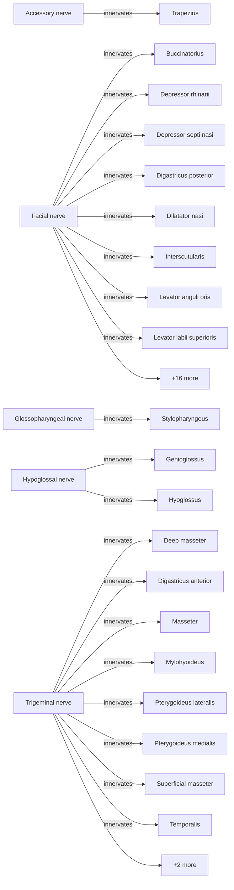

# Innervation Map

**Total Innervation Relationships:** 38

This page maps all neural innervation relationships between nerves and muscles.

## By Nerve

### Accessory nerve (1 targets)

| Muscle/Structure | Confidence | References | Notes |
|------------------|------------|------------|-------|
| Trapezius | N/A | N/A |  |

### Facial nerve (24 targets)

| Muscle/Structure | Confidence | References | Notes |
|------------------|------------|------------|-------|
| Buccinatorius | N/A | N/A |  |
| Depressor rhinarii | N/A | N/A |  |
| Depressor septi nasi | N/A | N/A |  |
| Digastricus posterior | N/A | N/A |  |
| Dilatator nasi | N/A | N/A |  |
| Interscutularis | N/A | N/A |  |
| Levator anguli oris | N/A | N/A |  |
| Levator labii superioris | N/A | N/A |  |
| Levator labii superioris alaeque nasi | N/A | N/A |  |
| Levator rhinarii | N/A | N/A |  |
| Mandibuloauricularis | N/A | N/A |  |
| Nasalis | N/A | N/A |  |
| Occipitalis | N/A | N/A |  |
| Orbicularis oculi | N/A | N/A |  |
| Orbicularis oris | N/A | N/A |  |
| Orbito-temporo-auricularis | N/A | N/A |  |
| Platysma cervicale | N/A | N/A |  |
| Platysma myoides | N/A | N/A |  |
| Sphincter colli profundus | N/A | N/A |  |
| Sphincter colli superficialis | N/A | N/A |  |
| Stapedius | N/A | N/A |  |
| Stylohyoideus | N/A | N/A |  |
| Zygomaticus major | N/A | N/A |  |
| Zygomaticus minor | N/A | N/A |  |

### Glossopharyngeal nerve (1 targets)

| Muscle/Structure | Confidence | References | Notes |
|------------------|------------|------------|-------|
| Stylopharyngeus | N/A | N/A |  |

### Hypoglossal nerve (2 targets)

| Muscle/Structure | Confidence | References | Notes |
|------------------|------------|------------|-------|
| Genioglossus | N/A | N/A |  |
| Hyoglossus | N/A | N/A |  |

### Trigeminal nerve (10 targets)

| Muscle/Structure | Confidence | References | Notes |
|------------------|------------|------------|-------|
| Deep masseter | N/A | N/A |  |
| Digastricus anterior | N/A | N/A |  |
| Masseter | N/A | N/A |  |
| Mylohyoideus | N/A | N/A |  |
| Pterygoideus lateralis | N/A | N/A |  |
| Pterygoideus medialis | N/A | N/A |  |
| Superficial masseter | N/A | N/A |  |
| Temporalis | N/A | N/A |  |
| Tensor veli palatini | N/A | N/A |  |
| Zygomaticomandibularis | N/A | N/A |  |

## Visual Diagram

---
*Auto-generated innervation map*
